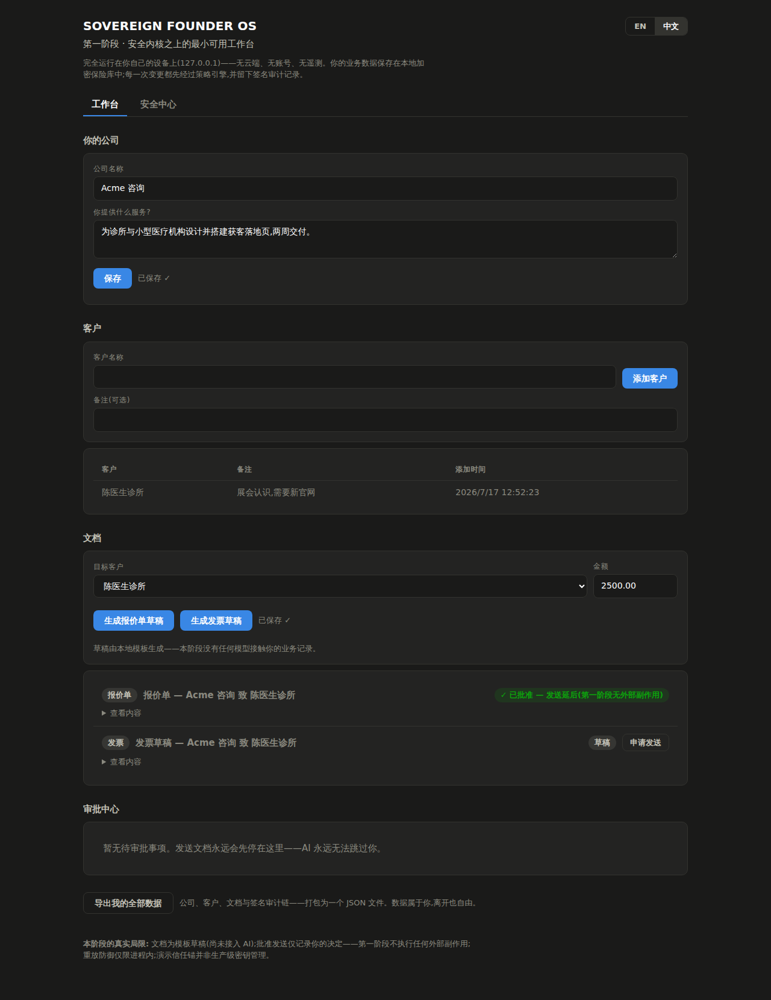
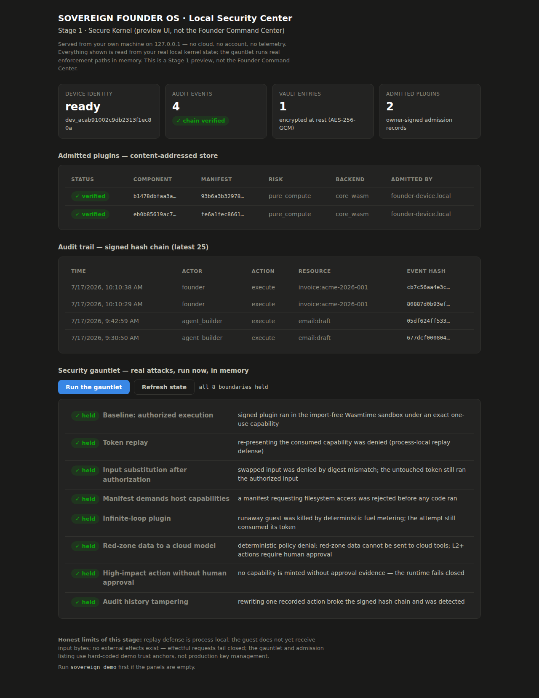

# Sovereign Founder OS

[](LICENSE)
[](ROADMAP.md)

> **Build and run your one-person company with AI—without giving up control of your data, decisions, or business.**

**Sovereign Founder OS** is an early-stage open-source AI operating system being built to help anyone start and run a one-person business while keeping their data, decisions, and business continuity under their control.

**[中文完整设计文档 →](docs/zh/README.md)**

---

## From Idea to Operating Business

The product vision guides a founder through the whole business loop, without requiring them to configure agents or understand software infrastructure:

```text
Understand the founder and their strengths
  → Find a viable business direction
  → Choose customers and validate their problems
  → Design the offer, product, and pricing
  → Decide today's most important work
  → Assemble an AI crew and execute
  → Win customers and collect feedback
  → Manage delivery, contracts, revenue, and risk
  → Improve the company continuously
```

Users see goals, decisions, approvals, progress, and the next action—not agent parameters, token counts, or tool schemas.

## Planned Product System

| Module | What it is designed to help the founder do |
| --- | --- |
| **Venture Studio** | Discover opportunities, validate customer problems, choose a business model, position an offer, and design pricing experiments |
| **AI Crew** | Bring together product, research, development, design, marketing, sales, support, finance, legal, and security roles for the task at hand |
| **Product & Delivery** | Build websites, prototypes, software, content, client deliverables, plans, and repeatable services |
| **Customers & Growth** | Define customers, manage leads and CRM, create campaigns and proposals, follow up, sell, and learn from feedback |
| **Finance, Legal & Tax** | Track income, expenses, invoices, cash flow, tax reserves, contracts, obligations, and professional escalation needs |
| **Founder Command Center** | Show company stage, current risks, key metrics, pending approvals, unvalidated assumptions, and the three most important next actions |
| **Sovereign Trust Layer** | Keep data, permissions, evidence, model choice, recovery, and the founder's right to exit under user control |

The **Sovereign Enterprise Graph** will be the structured source of truth beneath these modules: the founder, products, customers, projects, contracts, invoices, knowledge, metrics, risks, and decisions—not a pile of chat history.

## Scope and Users

The long-term audience is people exploring or operating a one-person business:
freelancers, independent consultants and creators, digital service providers,
and Micro-SaaS founders. Initial workflow validation focuses on **independent
consultants** rather than claiming to serve all of these groups at once. The
first candidate jurisdiction is Singapore, with later expansion through
versioned Jurisdiction Packs.

Sovereign Founder OS is not a multi-agent chat room, an autonomous lawyer, or a substitute for a founder's judgment and licensed professional advice. It will not put personal business data on a blockchain or promise absolute security.

## Why Sovereign

Business automation becomes dangerous when a model, plugin, cloud account, or platform can quietly become the owner. Sovereign Founder OS is designed so that useful AI assistance does not require that surrender:

- Data and authoritative business state must remain user-controlled and portable
- The system is designed to be local-first and independent of any one model or provider
- AI must not grant itself authority; important actions must require independently enforced policy and, when needed, human approval
- Plugins and external content must be treated as untrusted by default
- Important actions must leave tamper-evident, understandable evidence
- Workflows recover locally from covered process/model failure today;
  node/provider resilience remains a measured target or research question
- Core security, export, audit, and recovery will not be premium-only features
- Security limitations must be stated openly; the project will not claim absolute security

> **Long-term resilience benchmark:** Kill the model, the server, and the
> plugin. **The company keeps running.** This is a research target, not a
> current claim.

Read the **[Sovereign Founder OS Manifesto →](MANIFESTO.md)** for the principles we will not compromise.

## One Product, Clear Names

| Name | Role |
| --- | --- |
| **Sovereign Founder OS** | The complete product and the project's only primary brand |
| **AI Crew** | The user-facing team of AI roles assembled for a business goal |
| **Crew Orchestrator** | The internal subsystem that selects, constrains, coordinates, and dissolves each AI crew |
| **Sovereign Trust Layer** | The cross-cutting product layer for privacy, authority, audit, resilience, and data sovereignty |
| **Sovereign Runtime** | The underlying local-first, model-neutral runtime that implements the Trust Layer and controlled execution |
| **Sovereign Founder OS Manifesto** | The project's public position and non-negotiable principles |

### Core Concepts

| Concept | Description |
| --- | --- |
| **Sovereign Enterprise Graph** | Canonical structured digital twin of the company — not chat history |
| **Mutually Constrained Autonomy** | Planner, Policy Guard, Executor, Auditor, Recovery Controller, Human Owner — no single node holds all power |
| **Capability Tokens** | Short-lived, scoped execution permissions; durable token revocation is a target capability |
| **Resilient Trust Mesh** *(research)* | Possible future multi-node trust architecture, pursued only for a measured availability need |

## Documentation

### Recommended Reading Path

[README](README.md) → [MANIFESTO](MANIFESTO.md) → `WHITEPAPER` *(planned)* → [ARCHITECTURE](ARCHITECTURE.md) → [THREAT MODEL](THREAT_MODEL.md) → [RFCs](rfcs/) → [ROADMAP](ROADMAP.md) → `DEMO` *(planned)*

### Quick Start (English)

| Document | Description |
| --- | --- |
| [MANIFESTO.md](MANIFESTO.md) | The Sovereign Founder OS position and non-negotiable principles |
| [ARCHITECTURE.md](ARCHITECTURE.md) | System architecture |
| [THREAT_MODEL.md](THREAT_MODEL.md) | Threat model v0.1 |
| [ROADMAP.md](ROADMAP.md) | Outcome-led development roadmap (v0.1–v1.0) |
| [docs/INDEX.md](docs/INDEX.md) | Full documentation map |

### Design Notes and Project History

Specialist designs, product drafts, positioning, and historical documents live under [`docs/`](docs/INDEX.md). They provide context; the core documents and accepted RFCs are authoritative when material conflicts.

## Tech Stack (Planned)

| Layer | Technology |
| --- | --- |
| Sovereign Runtime | Rust |
| Desktop UI | TypeScript + React + Tauri |
| Agent Workers | Python (isolated, untrusted boundary) |
| Protocols | JSON Schema, gRPC, WASI, MCP, A2A |

## See It

The local app (`sovereign ui`, English/中文) — your business state in an
encrypted local vault, every send request stopped at an approval decision, and a
one-click attack gauntlet where every denial is a real enforcement path:

| Founder Workspace (工作台) | Security Center |
| --- | --- |
|  |  |

## Quick Start

With Rust installed:

```bash
git clone https://github.com/IcantFind-a-username/Sovereign-Founder-OS
cd Sovereign-Founder-OS
cargo run -p sovereign-cli -- ui     # opens http://127.0.0.1:7787
```

Prebuilt binaries for Linux, macOS, and Windows are attached to
[GitHub Releases](https://github.com/IcantFind-a-username/Sovereign-Founder-OS/releases)
when versions are tagged — download, unpack, and run `sovereign ui`.

## Current Status

Sovereign Founder OS is a **Developer Preview / pre-release**. No tagged
release is evidenced in this repository yet. The current product is a narrow,
local founder workflow backed by substantial security primitives—not the full
Founder OS and not a production security boundary.

The loopback web app (`sovereign ui`, English/中文) currently provides:

- a business-state read-only **Command Center** with business counts, pending
  decisions, deterministic guidance, and evidence summaries. Current first/open
  GET paths may initialize the co-located device/Vault key files, so this is not
  yet an authenticated, side-effect-free read boundary;
- a **Workspace** for one company profile, append-only customers, fixed local
  Offer/Invoice templates, a deterministic drafting stand-in, approval or
  rejection, local RFC 5322 `.eml` composition, revocation of that local file,
  an unauthenticated local manual-delivery marker, and plaintext JSON export;
- a **Security Center** for identity/vault metadata, audit verification,
  disclosure and admission records, state reconciliation, and an in-memory
  adversarial gauntlet.

The approved-composition path assembles real publisher verification, local
artifact admission, deterministic policy, signed approval evidence,
Capability V2, durable one-use authority claims, an execution journal,
import-free Wasmtime computation, a rooted local outbox write, and signed
hash-chain evidence. Its present boundary is **Experimental**:

- the backend creates the owner signature after an unauthenticated local API
  decision; independent owner-presence authentication is not implemented;
- the capability binds document/resource preparation, but not the final
  recipient and exact RFC 5322 bytes;
- the execution journal finishes before the trusted host writes the outbox
  file, so this is not yet an exact capability-bound effect protocol;
- the app performs no network send; “delivered” is only a locally entered,
  unauthenticated marker that someone says the file was sent manually.

The current Model Gateway and workflow demo are also experimental foundations.
Model providers are deterministic stand-ins rather than LLMs, and caller-owned
classification/provider self-reported trust must be removed before any real
public egress. Workflow recovery is another runner over the same durable
directory, not replicated multi-machine failover. See
[RFC 0004](rfcs/0004-data-sovereignty-boundaries.md) for the approved privacy
implementation target.

Run locally:

```bash
cargo test --workspace --locked
cargo run -p sovereign-cli -- init
cargo run -p sovereign-cli -- sandbox-check
cargo run -p sovereign-cli -- demo --fast
cargo run -p sovereign-cli -- ui
cargo run -p sovereign-cli -- model-check
cargo run -p sovereign-cli -- workflow-demo
cargo run -p sovereign-cli -- verify-export export.json
cargo run -p sovereign-cli -- integrity
```

Important current limitations:

- the loopback server rejects foreign `Host` headers and non-JSON mutations,
  but has no authenticated owner session; local callers can read decrypted
  workspace/export data through its API (private keys are not exposed there);
- the vault encrypts entries, but its master key is stored beside the data;
- export is plaintext workspace/audit JSON, not an encrypted backup or restore
  package, and integrity reconciliation does not bind every workspace field;
- customer/document editing, real models, network effects, clean-machine
  restore, Component/WIT plugins, and broader business modules remain targets;
  Secure Mesh remains Research.

The Rust workspace contains thirteen Runtime crates covering contracts,
identity, artifacts, policy, capabilities, authority, execution, effects,
vault, audit, sandboxing, models, and workflows. The detailed maturity and
release gates live in [ROADMAP.md](ROADMAP.md); sandbox protocol boundaries are
in [RFC 0002](rfcs/0002-wasm-sandbox-and-plugin-capabilities.md).

## Contributing

We welcome contributions from founders, product designers, Rust developers, agent framework developers, security researchers, privacy engineers, and domain experts. Start with [CONTRIBUTING.md](CONTRIBUTING.md), which explains how to find a useful first contribution.

Report security issues via [SECURITY.md](SECURITY.md) — do not open public issues for vulnerabilities.

## License & Intellectual Property

- **Code and documentation:** [Apache License 2.0](LICENSE)
- **Attribution:** [NOTICE](NOTICE)
- **Trademarks:** [TRADEMARK.md](TRADEMARK.md) — "Sovereign Founder OS" and related marks are protected

You are free to use, modify, and distribute this project under Apache 2.0 terms. Forks must retain license and attribution notices. Trademark use requires compliance with our trademark policy.

## Links

- Repository: https://github.com/IcantFind-a-username/Sovereign-Founder-OS
- Documentation index: [docs/INDEX.md](docs/INDEX.md)
- Why not another agent?: [docs/positioning/why-not-another-agent.md](docs/positioning/why-not-another-agent.md)

---

<p align="center">
  <strong>Designed for many models. Dependent on no single provider.</strong><br>
  <strong>Cryptographically verifiable. Founder-controlled by design.</strong>
</p>
