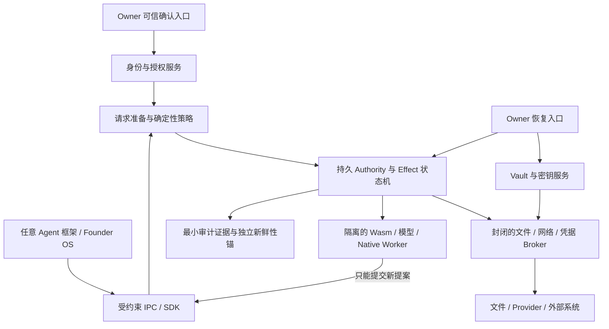
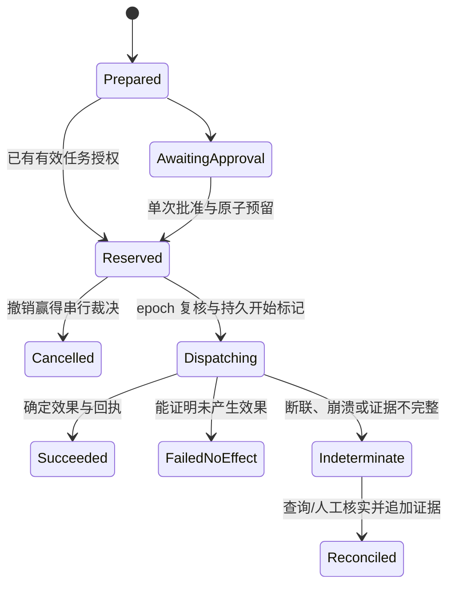

# Sovereign Runtime：Agent 通用安全底座审查与目标设计

日期：2026-09-16。审查基线：`84a5389`。状态：**设计提案，未成为已实现能力或已接受 RFC**。

实施入口：[Runtime Phase 1 开发与验收指南](runtime-phase-1-development-guide.zh-CN.md)。该指南将本审查映射到现有 RFC、Program 与 backlog，并记录本提案与既有规范的差异；本审查不另建任务队列。

## 0. 结论

建议把 Sovereign Runtime 定位为：**与模型、agent 框架和业务应用解耦的权限与副作用安全内核**。它负责让每次数据访问、凭据使用、权限委派和外部操作都有明确边界、可验证授权、持久证据和恢复语义。

要争取的标杆是：在公开威胁模型和受支持部署配置下，**即使模型已经被提示注入控制，越权的操作仍不能通过内核；即使进程中断，系统仍能准确区分“没有发生”“已经发生”和“结果未知”**。

这不是对所有攻击、所有主机或所有工具作保证。合法权限过大、批准了错误的业务意图、宿主 OS 被完全控制、远端服务撒谎，都需要明确的边界。最强的工程目标应当以这些边界下的可检验性质定义。

当前仓库值得保留的核心资产是：严格 artifact admission、角色分离的签名、精确调用绑定、不可任意构造的授权结果类型、import-free Wasm、持久 authority claims、故障测试，以及主动隔离 fixture 与产品的纪律。最大缺口是**这些能力还没有构成产品上不可绕过的完整链路**。

优先级建议：先打通可信 owner → 精确授权 → 持久预留/撤销 → broker 执行 → 证据/恢复的一个真实本地闭环；随后建立通用 SDK 和第二个框架接入；分布式 mesh、硬件证明、复杂策略语言和更多工具种类放在这之后。

实施约束：Runtime 先作为仓内架构边界，稳定嵌入 API 后再评估提取。独立安全服务首先要求逻辑上不可绕过，以及实际的进程/权限隔离；初期不要求 VM 或多租户。现有 RFC 0006 synthetic fixture 保持其已冻结范围，产品新边界按既有治理单独审查。

## 1. 审查范围与证据强度

### 1.1 本次做了什么

- 阅读根目录威胁模型、架构、路线图、RFC 0001–0007 的相关设计及安全 qualification 文档。
- 追踪产品 HTTP 路由、Workspace、model routing、签名审批、Capability V2、sandbox、outbox、authority store 和 audit 的主要调用路径。
- 单独审查 owner/exact-effect fixture、事务 reservation、Vault v2 私有 engine 的边界与接入状态。
- 运行默认全工作区测试；显式开启 owner/broker/fault 特性补跑相关测试，结果见第 14 节。
- 对照 MCP 最新安全指南、CaMeL、AgentDojo、Cedar、Wasmtime、seL4、OAuth 和 TUF 官方资料。

本次是源码与架构审查，结合既有测试回归。没有对所有源码逐行审计，没有进行真实凭据、真实资金或公网攻击测试，也没有完成跨平台硬件验证或独立渗透测试。下文区分“源码可直接确认”“由代码交错推导的风险”和“目标能力缺口”，不把它们混为已复现漏洞。

### 1.2 当前实现与总览文档有明显时差

审查不能沿用总览文档中的旧判断：

| 主题 | 当前源码事实 | 必须保留的限制 |
| --- | --- | --- |
| Model Gateway | `LocalVouch` 已封闭外部 adapter 自称 Local 的原始请求入口 | 内建 Ollama 获得 vouch，但进程身份、隔离和零出网仍未由产品保证 |
| Authority | 已有 `consume_bundle`、durable revocation、恢复 intent 与 commit marker | 文件系统 roll-forward 协议并不自动提供所有撤销/执行交错的事务语义 |
| Owner / exact effect | 已有非默认 fixture 类型、session、单次 approval、单写者锁、redb reservation；[WebAuthn adapter](../../fixtures/owner-webauthn/src/lib.rs) 已在独立 workspace 实现 | 真实认证器资格、产品 owner admission 和产品完整连接仍未完成；adapter 存在不代表这些门已通过 |
| Vault v2 | 私有 binary 已有 SQLCipher connection factory、DBK holder、FFI/OpenSSL 初始化硬化 | library 顶部“skeleton only”已落后；dispatcher、产品启用和恢复资格尚未完成 |
| Audit freshness | RFC 0007 已写出目标契约 | 当前 `AuditLedger::load` 仍只校验链；锚点目标还有设计问题 |

因此，总体成熟度应表述为：**已具备有价值的内核原语和隔离验证组件，产品安全边界仍属 Experimental**。不能按 RFC 数量、crate 数量或测试数量判断“已经生产级”。

## 2. 现有设计中应当保留的部分

1. **模型与授权分离。** V2 不直接接受可伪造的 V1 `PolicyDecision`；`PolicyAuthorizationV2` 由确定性策略路径构造。[policy](../../crates/policy/src/lib.rs)
2. **调用精确绑定。** `PreparedInvocation` 绑定 canonical input、artifact、manifest 和 resource commitments；V2 再校验 audience、subject、session、时间、policy digest、approval 和单次使用。[invocation](../../crates/artifact/src/invocation.rs)、[capability](../../crates/capability/src/v2.rs)
3. **供应链 admission 和运行权限分离。** 验证 publisher 不等于 owner admission，admission 不等于某次调用授权。这一层次应继续保持。[admission](../../crates/artifact/src/admission.rs)
4. **纯计算边界小。** 当前 Wasm 不链接任意 host imports；内存、fuel、epoch、输入与输出限制有实际机制。[sandbox](../../crates/sandbox/src/wasm.rs)
5. **故障不是普通错误的别名。** 已有 execution journal、`Indeterminate`、subprocess/fault fixtures 和防零测试假通过 runner。[execution](../../crates/execution/src/lib.rs)、[runner](../../scripts/run-owner-effect-regression.sh)
6. **fixture 不冒充 owner。** `FixtureBootstrap`、非默认 feature 和单独资格文档主动阻止试验结论进入产品。应沿用这种约束，而不是删掉隔离直接接线。[qualification](synthetic-owner-exact-effect-fixture-qualification.md)

## 3. 按优先级列出的审查发现

这里的 P0 表示“建立可信产品闭环前必须关闭”；P1 表示“开放对应能力之前必须关闭”。这是项目交付优先级，不是未经验证的 CVSS 评级。

### F01 / P0：产品 owner 授权根没有独立建立

**源码确认：** `apps/cli/src/ui.rs:160` 的路由先做 Host allowlist；读取 `/api/workspace`、`/api/export`、outbox，以及审批 POST 没有已认证 owner session。JSON Content-Type 和不开放 CORS 有浏览器侧防护价值，但本地原生进程可以构造这些请求。`kernel_exec.rs:154` 随后从 Vault 读取 approval 私钥并自行签署 owner evidence。

**影响：** 能接触该 loopback API 的本地进程，在当前边界下可以请求业务数据或触发应用代签审批；有效签名不能证明独立的人类批准。风险描述限定于此，不推断任意远程网页都能读取响应。

**目标：** owner enrollment、session、审批签署、role-key custody 放到可信入口和独立服务。所有业务 read/list/preview/decrypt/export 和状态写入都必须要求相应授权；session 与单次动作批准分开。

**验收：** 未认证原生客户端、另一端口网页、重启前 session、重放 assertion、另一个 workspace 的 approval 均不能读取保护数据或创造授权。

证据：[UI](../../apps/cli/src/ui.rs#L160)、[owner signing](../../apps/cli/src/workspace/kernel_exec.rs#L154)、[fixture 的真实限制](synthetic-owner-exact-effect-fixture-qualification.md)。

### F02 / P0：当前密钥与业务密文共址，角色隔离主要停留在逻辑层

**源码确认：** `Vault::init` 在 Vault 目录创建/读取 `vault.key`；`StoredIdentity` 持有 `secret_key_b64`。Workspace 能取出 approval、admission、authority 私钥。复制整个工作目录可同时获取密文与解密根。

**影响：** 当前加密不能兑现“整个目录被复制仍保密”；一个能读取这些根的应用进程也拥有多个签署角色。Rust 角色类型能防误用，无法阻止已控制这个进程的攻击者使用现有私钥。

**目标：** 按 RFC 0005 完成设备/恢复双根、角色密钥分域和独立 key broker；前端与普通 agent 不持有原始密钥。`OsProtected`、`HardwareBacked`、`NonExportable`、`UserVerified` 分别出具证据。

**验收：** whole-workspace copy 不解密；设备保护器失效时拒绝开启；复制一条签名角色的材料不能替代另一角色；新设备恢复不继续使用旧 session 和 bearer authority。

证据：[Vault](../../crates/vault/src/lib.rs#L54)、[identity format](../../crates/identity/src/device.rs#L124)、[engine main](../../crates/vault-v2-engine/src/main.rs)、[RFC 0005](../../rfcs/0005-dual-root-vault-and-recovery.md)。

### F03 / P0：批准的调用与最终 `.eml` 效果尚未精确绑定

**源码确认：** `prepare_delivery_invocation` 只装入 `document_id` 与 resource。最终 `delivery` 字节独立传入 `execute_signed_approval`；sandbox 结束后，应用调用 `write_outbox_effect` 写文件。`OutboxBroker::write_message` 接受 key、调用者给定的 data class 和 contents，不要求内核签发的精确 effect grant。

**影响：** 被证明获准的是 delivery preparation。最终收件人和精确内容没有被这一 invocation 证明覆盖；sandbox journal 的 Completed 也不是最终文件效果的完成证据。当前效果仅是本地文件，不能据此推断已经存在真实邮件发送漏洞。

**目标：** trusted preparation 冻结收件人、发送账户、最终字节或确定性输出承诺、版本前置条件，审批绑定该准备结果；effect broker 只接受一次性 grant handle，按其引用读取不可变 payload，不再接受独立可替换参数。

**验收：** 审批后修改任一收件人、附件、金额、payload、对象版本或目的地都必须重新准备与授权；无 grant 不能直接写 outbox。

证据：[prepare](../../apps/cli/src/workspace/kernel_exec.rs#L404)、[调用顺序](../../apps/cli/src/workspace/kernel_exec.rs#L40)、[effect API](../../crates/effects/src/lib.rs#L119)。

### F04 / P0：已有 bundle/revocation，但撤销与授权提交缺少共同的串行裁决点

**源码交错推导，未在本次强制调度复现：** `bundle_commit` 先检查 revoked records，后发布 `.committed`；`revoke` 先发布 revoked record，再读取是否已有 committed marker。这些操作没有共同事务或互斥的裁决点。

```text
A：最后一次检查未撤销
B：持久写入撤销；未见 committed → 返回 Revoked
A：发布 committed → 返回授权成功
```

不能据此承诺“撤销返回成功后，竞争中的尚未提交授权不会继续成功”。“检查两次”与“共享同一个原子裁决点”不是同一性质。已有代码较旧的三个独立 claims 有实质进步，不能误称为完全没有 revocation。

**另一个源码确认的问题：** authority 的 `sync_directory` 忽略目录 open/sync 失败。若存储无法兑现目录持久性，调用者仍可能收到成功；断电后 authority 消费记录是否保存不能由这个返回值证明。

**目标：** 单写者 authority service 使用一个事务存储裁决 approval、token、idempotency、预算、epoch、intent 和撤销；明确每一步何时不可取消。关键 durability error 不吞掉。

**验收：** 在最后检查与发布、reserve 与 dispatch、目录 sync 与返回之间设置屏障，做真实进程竞争、强杀、重启和故障注入；结果须符合第 7 节状态机。

证据：[bundle commit](../../crates/authority/src/lib.rs#L482)、[revoke](../../crates/authority/src/lib.rs#L563)、[目录同步](../../crates/authority/src/lib.rs#L766)、[fixture reservation](../../crates/authority/src/broker/reservation.rs)。

### F05 / P1：fixture 的 dispatch 错误语义尚不足以复用为产品保证

**源码确认：** `broker/dispatch.rs` 执行 rename 后还会同步目录；任一步报错均进入 `Unavailable` 分支并清理 temp。但 rename 可能已经成功，最终文件可能存在。此时“没有发布”的错误语义不成立。`recover` 还主要依据路径存在性，而不是持久状态加 payload 校验。

**目标：** 明确发布前与发布后故障；发布后不确定持久性/回执的情形进入待核实状态。产品 dispatcher 必须以可信 store 的 intent、版本和内容承诺复核磁盘结果。原始 unknown 记录保留，核实通过追加事件完成。

**验收：** 对 rename 成功而 dir-sync 失败、receipt 写失败、同名错误内容、半写、进程重启分别断言；绝不能把“可能已经产生副作用”报告为“未执行且可安全重试”。此发现针对非产品 fixture，不宣称当前产品已启用该路径。

证据：[dispatch](../../crates/authority/src/broker/dispatch.rs#L77)。

### F06 / P1：策略内核还不是通用的默认拒绝权限系统

**源码确认：** `evaluate_rules` 基于工具名称前缀、少数高风险操作、automation level 与路径规则，未命中 denial 时允许。`AuthenticatedPolicyContextV2::new` 的公开构造器验证字符串/UUID 的形状，并不独立认证 subject、session 或 data class。

**影响范围：** 当前 V2 还要求 pure-compute risk class、admitted artifact 和允许的 selector，这些限制确实有效。问题在于直接把现有 policy 函数扩成通用 effect 授权器，会把新动作默认放行，或把 host 自报属性误当认证结果。

**目标：** 未注册动作和未知资源类型默认拒绝；硬约束必须全部成立，显式 deny 优先；上下文只由 broker 从认证主体、可信对象表和不可变 policy snapshot 建立。V1 demo 不进入新的严格产品 profile。

**验收：** 新增未知 action、拼写变体、伪造租户、篡改资源归属、缺失策略属性、解释器错误全部拒绝，而不是自动继承低风险权限。

证据：[policy](../../crates/policy/src/lib.rs#L339)、[context](../../crates/policy/src/lib.rs#L44)、[V2 的限制](../../crates/capability/src/v2.rs#L650)。

### F07 / P1：Ollama 的 Local 资格还不是进程隔离与身份保证

**源码确认：** 原始请求已经要求 core `LocalVouch`。Ollama constructor 限制 loopback URL，但使用 TCP 连接，产品没有认证那个进程、绑定模型 digest、限制它的文件/网络权限。源码明确说明不隔离 Ollama。

**影响：** loopback 说明连接目的地，不证明服务身份，也不保证服务不会再向外发送数据。`localhost` 还需要在解析后验证实际连接地址。不能将此配置称为“受控本地计算”或端到端 Local Only。

**目标：** 增加受管理的本地 worker profile：验证启动工件、认证 IPC、固定 workload 身份、限制网络/文件/进程/环境、绑定模型和运行配置。保留独立的 external-local-server 兼容 profile，显示真实限制。

**验收：** 换端口监听进程、替换模型、尝试打开原始 socket/宿主文件/继承句柄均被拒绝或使该 profile 失去资格。

证据：[LocalVouch](../../crates/model/src/lib.rs#L109)、[路由拒绝](../../crates/model/src/lib.rs#L250)、[Ollama](../../crates/model/src/ollama.rs)、[product config](../../apps/cli/src/workspace/model_config.rs)。

### F08 / P1：privacy compiler 的类型与自由文本规则还没有形成完整信息流边界

**源码确认：** `TrustedValue::public_content` 允许调用者提供任意字符串；`Disposition::Public` 仅拒绝 `RestrictedDerived`，不会要求值确实为 PublicContent；`ScrubbedText` 分支没有同等的来源拒绝。已知名称替换不能覆盖未登记的秘密、语义重述或从上下文推导的敏感事实。

**限制：** 产品 exposure view 明确 `dispatch_available: false`，本次没有发现这条预览已发送到真实公共模型。这里是公开模型启用前的边界缺口，不是已发生的云泄露。

**目标：** 区分“结构上可证明不含被保护输入的投影”和“包含自由文本、需要 owner 明确批准的披露”。来源由数据入口建立，不能靠重新包装字符串清洗。机密性、完整性和权限分别追踪。

**验收：** 在所有 disposition 上遍历外部来源；将 RestrictedDerived 经过摘要/记忆/拼接/rehydration 后重投喂不得提升信任；替换任一被禁止披露的输入，自动投影可观察结果应保持不变，或触发新批准。

证据：[value](../../crates/privacy/src/value.rs#L37)、[compile](../../crates/privacy/src/compile.rs#L274)、[preview](../../apps/cli/src/workspace/privacy_ops.rs#L226)。

### F09 / P0（保证设计）：签名链与 RFC 0007 的锚点仍不能独立证明新鲜性

**现状确认：** 账本验证证明内部链接和签名。当前没有独立受保护的最新 head。RFC 0007 提议把 `ledger.head` 放在同目录，同时允许未曾 anchored 的 legacy ledger 初始化。

**设计问题：** 攻击者不需要伪造签名，只需一起恢复旧 `ledger.json` 和旧的有效 `ledger.head`。仅把 signing key 移进硬件，也无法防止这种 replay。若“曾经 anchored”的事实只在可回滚目录里，删除锚点后又无法可靠区别旧 legacy 与被攻击状态。它还是 workspace-directory rollback，不应仅归为全设备回滚。

**目标：** 独立于可恢复目录的可信 freshness 状态必须保存 workspace_id、generation、sequence/head 及 enrolled 标志；明确丢失或落后时的恢复协议、写入顺序与最大未见证窗口。锚点保护的是最新值和不可降级状态，签名只是其中一部分。

**验收：** 旧账本＋旧锚点、删锚点、跨 workspace 替换、升级后删除 enrolled marker、备份恢复、锚点落后、全设备回滚分别有真实预期。最后一种在没有外部见证/可信计数器时不能声称可检测。

证据：[ledger load](../../crates/audit-ledger/src/lib.rs#L173)、[RFC 0007](../../rfcs/0007-audit-ledger-freshness-anchor.md)。

### F10 / P1：安全机制仍有可选配置，编译器和 native backend 扩展需单独准入

**源码确认：** journal、compiler worker、compiled cache 是 `Option`/builder 配置。产品 delivery 路径挂了 journal，没有挂 compile worker。当前工件是内建纯计算模块，不能把未来任意第三方输入的风险套在它身上；但通用插件入口必须有更强默认配置。

**目标：** 严格运行 profile 构造时就要求对应保障，缺少隔离 backend 或 durable store 则不成立。不可信 Wasm 编译也在无秘密、可杀死的 worker 内完成；AOT cache 绑定 engine/config/target/CPU/artifact 并认证后加载。

**验收：** 省略依赖不能构建 effect runtime；错误 cache/config、hostile compilation、超限、worker 死亡必须拒绝；没有任何 fallback 自动进入权限更大的执行模式。

证据：[可选配置](../../crates/sandbox/src/lib.rs#L224)、[产品 executor](../../apps/cli/src/workspace/kernel_exec.rs#L302)。

## 4. 目标系统：小型参考监控器，外接明确受控的服务

“参考监控器”指每一次受保护操作都必须经过、调用者不能篡改或绕过、并且足够小以便审查的权限裁决与执行边界。**crate 隔离用于限制 API；OS 进程/权限隔离用于限制恶意代码。两者都需要。**



### 4.1 最小可信计算基

可信计算基（TCB）包含：owner admission 与 trusted display、认证 IPC、解析/规范化、确定性策略硬约束、authority/effect 状态机、key custody、必要的资源 broker、审计/恢复控制，以及这些组件依赖的 OS 与密码/存储库。

角色分离还必须成为实际调用限制：authority issuer 不能修改 owner 注册表或调用任意 owner 签名；owner signer 只在独立验证绑定动作的 assertion 后签发 approval；key broker 不开放通用的“用这把高权限 key 签任意 bytes”。否则即使私钥不可导出，攻击者仍可把签署服务当作代签器。

模型、agent planner、网页解析、文档解析、大部分业务逻辑、第三方 MCP server、通用 Python/Node 环境不应进入这个集合。第三方 adapter 不能因为连接了某个框架就获准访问密钥或可信数据库。

每条高权限边都需要列明：谁调用谁、接收什么类型、由谁认证、在哪个进程、拥有哪种 OS 权限、异常怎么处理。不要只维护方框图；维护实际 process/IPC/文件句柄/网络出口清单。

### 4.2 部署 profile 分层

| Profile | 可保证的范围 | 准入条件 |
| --- | --- | --- |
| Embedded / compatibility | 帮助受信任应用正确调用内核 API | 不承诺能阻止恶意宿主绕过；只能作为集成便利层 |
| Managed local | 对受管 agent/worker 强制执行本机资源与出网约束 | 独立安全服务、可信 owner 入口、OS 隔离、单写者持久状态、全出口接管 |
| Strongly isolated workload | 承受更强的 native worker 或跨租户风险 | 每任务/租户隔离、经验证的 VM 或平台沙箱配置、宿主与凭据分离 |
| High assurance appliance | 更强的宿主/硬件和证明需求 | 独立部署设计；seL4、TEE、远程证明等分别研究和验证，不继承上一层结论 |

macOS/Windows/Linux 分别出具 evidence。仅有同 UID 的文件权限或一个本地端口，不足以在所有平台防御恶意同账户进程。若某平台不能兑现 app identity、key ACL 或 worker confinement，就降低该 profile 的保证，不用另一平台的测试代替。

seL4 值得借鉴的是“小边界＋明确配置＋可复核证明”的方法；其证明范围依赖具体配置，不能因引用 seL4 就宣称整个应用已被验证。[seL4 verified configurations](https://docs.sel4.systems/projects/sel4/verified-configurations.html)

## 5. 把产品愿景改写为十二条可检验不变量

1. **完整仲裁：** 受管工作负载的每一次受保护读取、披露和外部效果都经过 broker，无法使用环境权限绕过。
2. **权力不凭空产生：** 模型文字、工具输出、摘要、记忆和 agent 消息不能创造主体身份、权限或 owner 批准。
3. **权限只收缩：** 子任务 authority 必须是父授权、当前政策、资源范围、信息流规则和剩余预算的交集。
4. **批准与执行一致：** 核验的 recipient、payload、账户、对象版本、时间与 policy snapshot 必须与最终效果一致。
5. **撤销有明确先后：** 在取消截止点前完成的撤销阻止开始；截止点后返回“已开始/待核实”，不能谎报已阻止。
6. **一次消费：** 单次 grant 不因重启、并发、旧备份或 token purge 恢复可用。
7. **先留证据再越边界：** 无法持久记录 intent 和 authority 状态时，不开始效果。
8. **未知不能自动重试：** 不能证明未执行的效果，不得当作普通失败重试或切换另一 provider 重发。
9. **秘密不作为普通值流动：** 长期认证凭据、私钥和恢复材料只有封闭 broker 可使用，模型与通用插件拿不到 bytes。
10. **保密与来源不被清洗：** 摘要、压缩、重新包装、模型改写和跨 agent 转发不自动降低机密性或提高完整性。
11. **恢复不恢复旧权力：** 数据恢复与 authority 恢复分开；恢复后旧 session/grant/epoch 不能复活。
12. **故障只收紧新权限：** store、时钟、锚点、密钥服务或隔离 backend 不可用时，停止新的敏感效果；经独立授权的读取/恢复路径保持尽可能可用。

这些性质需要绑定 threat model、产品 profile、代码版本、测试和残余风险。第 1 条若不能成立，其他十一条都只能描述“走正确 API 时会怎样”。

## 6. 权限系统：任务授权、具体调用、最终效果三级收缩

### 6.1 稳定的对象和授权语义

建议保留现有 Capability V2 的 pure-compute 合同，新增版本化的 effect 合同，避免在已签名字节上直接改字段。

```text
Owner policy / MissionGrant
    → admitted workload 的 InvocationGrant
    → 一个 broker、一种动作、一个不可变效果的 EffectGrant
```

MissionGrant 表示可以自主完成的有限任务范围。例如：“本周读取这个项目已授权的资料，最多生成十份草稿；不外发、不部署；调用预算有上限。”它不是让模型从自然语言自行提取权限的凭证。自然语言可以生成候选 policy；可信界面和确定性规则决定实际授权。

每个 grant 至少绑定：协议版本、issuer/audience、owner/tenant/workspace、workload/agent-run、父授权、artifact/adapter digest、action、资源对象与版本、输入/效果承诺、允许接收方、policy/schema version、revocation epoch、期限、使用次数、幂等键、预算预留、隔离 profile。

这些字段分属不同职责的证据对象，不要求塞进一个万能 token。进程内使用 opaque handle；跨进程/远端的 token 要绑定已认证 workload 或持有证明，避免泄露后任意持有者都可用。

### 6.2 委派、预算与防止多 agent 合谋

- 子授权不能扩 action、resource、recipient、deadline、数据分区或 delegation depth。
- 子任务的预算从共同 ledger 预留，所有子任务总额加已花费量不得超过父上限；不能给每个子 agent 各复制一份父预算。
- 父 grant 撤销通过可信 epoch/祖先状态传播；缓存决策要有明确失效界限。
- 两个窄 grant 不能由 agent 自行拼出更宽的一次操作。需要组合时，由政策明确允许并一次预留所有必要 authority。
- agent 输出只有建议；它不能给另一个 agent 签“owner approval”。增加多个评审模型能提高业务质量，不能替代独立授权。
- 自动任务使用已有有限 MissionGrant；超范围才升级审批，避免每一步都弹确认而导致审批疲劳。

### 6.3 确定性策略

保留小型 Rust 硬约束层，负责 epoch、tenant、所有权、类型、scope 收缩、预算与密钥用途等不允许业务 pack 覆盖的规则。复杂 ABAC/关系策略可评估 Cedar，但先有明确复杂度需求。

若采用 Cedar，必须加自己的严格封装：它有 default deny 和 forbid-overrides，也有 **skip-on-error**；安全关键请求若出现 evaluator diagnostics errors，应由本产品拒绝，不能误以为上游默认 deny-on-error。[Cedar authorization semantics](https://docs.cedarpolicy.com/auth/authorization.html)

政策输入来自可信数据目录和认证 workload；缺字段、循环关系、超限、过旧 snapshot、未知 schema、策略编译失败都不能变成允许。policy 更新也是受保护效果，需要版本化、差异预览、授权、审计和回滚方案。

## 7. 精确效果与崩溃语义

### 7.1 对最终效果建模

只绑定“调用了 send_email”不够。邮件示例的准备结果至少包括：发送账户、envelope recipients（含 cc/bcc）、显示收件人、附件和正文的最终 bytes/承诺、对象版本、允许的 provider/endpoint、有效期。

金额使用最小货币单位的整数并绑定 currency，避免浮点与单位歧义；路径由 broker 解析成对象/预打开句柄；URL 由成熟 parser 解析并按业务语义规范化。对外部系统不能保证的字段，只按明确 adapter contract 保证，不能许诺所有线上的 HTTP/TLS 字节都等于 UI 展示。

预览必须由同一个冻结的 PreparedEffect 生成。人看到的是可理解的收件人、动作和差异；签署挑战绑定这个对象的 digest、schema、session、workspace 和 nonce。模型不得撰写会影响授权的唯一预览摘要。

WebAuthn/user verification 本身证明认证器完成了某个 challenge，不证明人看见了正确的业务内容。可信预览入口属于 TCB，需要隔离不可信 HTML、跨端口来源和普通 agent 内容；更高保障的高风险交易可要求独立设备确认。第一次 owner enrollment 也不能采用“空注册表中第一个注册的人就是 owner”的无认证规则。

### 7.2 状态机与取消截止点



- `Reserved` 中原子记录 approval/token 消费、幂等绑定、预算预留、资源版本、effect intent 与 policy epoch。
- `Reserved → Dispatching` 是由单写者服务裁决的启动点，必须与撤销检查串行；从此以后不能承诺撤销会追回已经发出的网络字节。
- dispatch 使用不可变 payload 和限定凭据句柄；外部凭据只在具体受控调用处注入。
- 外部系统若支持幂等键，使用稳定操作标识并校验业务 payload 一致。若不支持，保留单次尝试与 unknown/reconcile 语义。
- 外部效果与本地数据库通常没有共同事务；必须记录这个事实。不能把本地 ACID 推广成跨系统 exactly-once。
- 原始 `Indeterminate` 不被改写为“当时已成功”；后续追加 reconciliation 证据。确认未发生后再次执行，需要受政策约束的新尝试。
- provider 失败不能默认换服务重发：新的接收方必须预先被准确授权，且先前尝试不处于未知状态。

本节是通用目标草图。Phase 1 沿用 Program 2 / RFC 0006 更严格的既有合同：进入 `Dispatching` 后只收敛为 `Succeeded` 或 `Indeterminate`；上图 `FailedNoEffect` 分支不作为本期实现许可。若要引入该分支，须先修订相应规范并证明未产生效果。

### 7.3 持久化选择

采用一个可信单写者 authority/effect 服务；优先把互相依赖的权威状态放入一个事务域。当前 redb fixture 证明了 reservation 机制，但不加密、不认证，也没有自动继承 Vault 的恢复/rollback 保证。

产品可在现有 RFC 0005 SQLCipher 路线下增加封闭的 authority/effect 存储接口。若因隔离理由保留多个进程/数据库，先明确哪一份状态是权威、协议怎样恢复、消息怎样幂等；不可假装两个库天然有一个原子事务。

这里的存储接口仍需独立设计审查，不表示把 authority、签名密钥或凭据放入业务 SQLCipher DB。RFC 0005 规定它们与 DBK 分域，不能为统一事务而取消该边界。

单写者改善一致性，不意味着可以丢失服务。服务故障应停新效果，但允许按受控恢复协议重启；数据读取和恢复工具不依赖模型供应商。

## 8. Agent 时代的数据与控制流防线

### 8.1 分开建模机密性、完整性和执行权

一个值至少关联：workspace/tenant、数据分区、机密性、来源集合、用途与接收方约束。完整性描述内容从哪里来、经过什么验证；它不证明内容正确。权限是另外的主体/资源关系。

`NonDisclosableSecret` 是独立 handle-only 类型，不能成为 `LabeledValue<String>` 的某个标签。否则调用者只要能取出 String，禁令就已经失效。

外部网页、邮件、MCP 输出、OCR、音频转写、RAG 文档和模型响应默认带不可信来源。memory 写入、summary、embedding、检索结果、缓存、跨 agent 消息都保留来源和机密性；不同 workspace 的索引、向量、KV cache 与临时文件不能无授权共享。

### 8.2 传播规则

- 确定性变换的输出至少继承所有数据依赖及敏感控制依赖的约束。
- 对无法证明更细粒度依赖的模型调用，整个输出保守继承该调用所有输入的机密性；不能接受模型自报“这一段没用到秘密”。
- 对含敏感条件的分支，发不发请求、发给谁、错误消息与日志也可能成为泄露通道。严格 profile 限制这类依赖；无法封闭的 timing/资源争用侧信道明确列为残余风险。
- 解密、摘要、翻译、rehydration 不等于解密后的数据可以公开；从外部变成内部存储也不等于变成可信指令。
- **降密**（允许向某接收方披露）与**提升完整性信任**是两个分别授权的动作，不能用一次“已检查”同时完成。

CaMeL 提供了把控制/数据流与模型行为分离、在工具调用处强制策略的重要参考。但其论文也单独讨论非目标、侧信道和降密疲劳；不能把论文 benchmark 结果当成本项目的产品证明。[CaMeL v2](https://arxiv.org/html/2503.18813v2)

### 8.3 两类公共投影

1. **自动安全投影：** 闭合 schema、固定字段、确定性变换；为被禁止的输入建立可观察等价性质。它可以在预批准的任务范围内自动发送。
2. **owner 明确披露：** 仍含自由文本或商业语义的内容，在可信 UI 上展示确切接收方和 payload，再生成限定本次披露的 grant。不能标为“自动匿名化已保证安全”。

每次出站 broker 复核 transform/version、批准的接收方集合、policy epoch、对象版本与期限。排队后、重启后、provider failover 后均不能沿用过期预览。敏感日志也不能用可穷举的裸 SHA-256 来冒充脱敏；必要详细记录保存在加密、授权可读的证据层，公开证明只含最小元数据。

## 9. 执行与连接器：凭据永远留在封闭 broker

### 9.1 三类执行路径

- **Wasm 纯计算：** 沿用当前零 import 路径；不可信编译放在独立无秘密 worker，燃料之外限制编译时间、内存、并发与输出。
- **受审查的 effectful WIT：** 每一个 host function 都有 schema、scope、预算和故障语义；WASI 只开放按需预打开的资源，不接受万能 filesystem/network 接口。
- **Python/Node/native/browser：** 每任务工作目录、只读基础镜像、最小环境和句柄、网络出口限制；高风险或跨租户任务采用适当的 VM/平台隔离。用户主浏览器 profile 和 agent 的工具浏览器不能随意共享会话权力。

Wasmtime 的安全边界取决于暴露给 guest 的 imports；增加强大 host function 就扩大了授权面。终端转义序列也可能造成宿主效果，因此所有模型/工具输出需要惰性文本渲染和有界处理。[Wasmtime security](https://docs.wasmtime.dev/security.html)

### 9.2 每个 broker 的合同

| Broker | 内核必须掌握的事实 |
| --- | --- |
| File | 已授权根/对象、句柄身份、版本、读写上限、路径解析规则；抵御 symlink、hardlink、rename 和路径检查后替换 |
| Network | 固定 scheme/host/port/method、实际连接目标、TLS 验证、每次 redirect、DNS 变化、正文与响应上限、metadata/private 网络策略 |
| Credential | owner enrollment、provider/account/audience/scope、用途、失效/轮换；只向已授权 adapter 的具体请求注入，不向 agent 返回值 |
| Model | 受管 worker 身份或已授权远端 recipient、准确数据投影、模型/配置版本、保密标签、结果大小、未知调用结果 |
| Browser | 隔离 profile、域与导航边界、表单目标、下载/剪贴板等效果；高风险提交通过可信预览与业务 adapter |
| Deployment / finance | 精确资源、对象版本、账户/金额/单位、审批级别、不可逆性、幂等及 reconciliation 方法 |

域名 allowlist 仍然允许向该域名传任意数据，因此它不能替代 payload 授权。自建 DNS/IP parser、通用 `curl`/shell passthrough、向插件发永久 API key，都不应成为快速集成方案。

### 9.3 MCP、OAuth 和框架兼容

MCP 放在内核外侧，tool schema/description/annotation 作为不可信输入。连接建立、OAuth consent、publisher signature 与单次业务效果授权各有职责，不能互相代替。

适配器把已注册的 MCP tool 映射为内核 action；远端 server 可以变化的工具定义需要版本/摘要校验和重新 admission。OAuth metadata discovery 本身也需要 broker，不能让发现过程变成绕过网络策略的 SSRF 路径。MCP 的当前指南明确要求处理 confused deputy、audience/token passthrough 和 SSRF 风险。[MCP 2026-07-28 安全指南](https://modelcontextprotocol.io/docs/2026-07-28/tutorials/security/security_best_practices)

对远端互操作可采用既有 OAuth 能力，而非自创传输凭据协议：RAR 表达细粒度授权请求、Token Exchange 表达明确委派场景、DPoP 在适用 endpoint 约束 token 持有者。但它们均不自动实现本地 effect 的原子性、降密规则或业务预算。[RFC 9396](https://www.rfc-editor.org/rfc/rfc9396.html)、[RFC 8693](https://www.rfc-editor.org/rfc/rfc8693.html)、[RFC 9449](https://www.rfc-editor.org/rfc/rfc9449.html)

## 10. 密钥、审计与恢复：证据必须可核实，也不能泄密

### 10.1 密码与密钥路线

继续 RFC 0005 的标准组件路线：SQLCipher、设备与恢复分别包装 DBK、已审查的 key wrapping、标准 age 备份与参数受限的 Argon2id。复用现有 signed-contract 与 canonicalization 约定，新的 wire version 单独迁移；不重排已经签名的字段。

核心工作是 key lifecycle：创建、用途分域、设备注册、解锁、轮换、丢失、吊销、恢复。验证 backend 真正实现的 ACL/硬件属性；不要用“用了 Keychain/TPM”代替应用级验证。敏感内存需尽量减少拷贝、及时清理，并把 swap、dump、GPU 内存和磁盘历史残留写进平台 profile。

### 10.2 分层证据

1. **受保护的操作记录：** actor、授权来源、policy/adapter/input/对象版本、效果前后状态、回执与恢复信息，按需要加密并受 owner 授权读取。
2. **最小验证记录：** 序列、作用域绑定、不含业务明文的引用、签名和链连接；仍评估次数、时间和关联标识的元数据风险。
3. **独立 freshness witness：** 保存当前 generation/head，拒绝旧状态；见证只需要承诺，不需要业务明文。支持本地独立受保护状态或用户自选外部见证，不强制依赖官方云。

签名只能证明相对于受信任 key 的记录一致性，不能证明外部世界真实发生了什么，也不能在 key 已泄露时证明“必定是 owner”。独立 verifier 需要预先已信任的根及锚状态；从同一份待验证导出里取公钥，只能自洽验证。

### 10.3 恢复是 authority 变更

- 执行停止、持久 freeze、撤销新 dispatch、保留 unknown intents。
- 恢复 ciphertext 和业务状态，验证 schema/完整性/范围及备份资格。
- 独立检查 freshness 与代际；只有旧备份而无最新见证时，进入显式受限恢复，而不是自动宣称“最新状态”。
- 建立新 device/session/authority epoch；旧 bearer tokens、pending grants、缓存批准和被恢复的 session 失效。
- 对未知的远端操作逐项 reconciliation；不重放恢复前的付款/邮件/部署。
- 重新注册需外部重新授权的 provider credentials；业务备份不夹带长期认证凭据。

恢复测试覆盖：仅设备密钥、仅恢复材料、两者均在、两者均失、旧 recovery wrapper、部分文件丢失、旧数据库配新锚、旧锚配新数据库、全设备回滚。离线可恢复不代表离线可以知道全球最新状态。

## 11. 对外稳定接口与当前代码迁移

### 11.1 SDK 应暴露的能力

建议提供三类核心调用；这是语义草图，不是冻结的 Rust ABI：

```text
prepare(authenticated_workload, untrusted_proposal) -> PreparedActionId + Preview
authorize(prepared_action_id, owner_assertion | existing_mission_authority) -> GrantHandle
execute(authenticated_workload, grant_handle) -> Receipt | Indeterminate
```

再提供 `status/revoke/reconcile` 与受控数据读取接口。`execute` 不同时接受独立 recipient/body/token 参数，避免审批后替换。Python/TypeScript/MCP 客户端持有序列化引用，内核服务独立核验；客户端类型检查只改善使用体验。

### 11.2 建议的代码落点

| 当前模块 | 下一步职责 |
| --- | --- |
| `contracts`, `identity`, `artifact` | 保留现有签名形状与 admission；新增版本化 effect contract 和 workload 身份绑定 |
| `owner` fixture | 保留试验隔离；经独立 design/qualification 后另建真实 admission 与 key custody 接口 |
| `policy` | 保留 V2 精确 proof；增加默认拒绝的 action registry、可信上下文与不可覆盖硬约束 |
| `authority`, `execution` | 合并权威裁决语义：持久 reservation、revocation、预算、effect 状态机；停止新增两套竞争状态 |
| `effects` | 从“host 随意传 bytes 的工具”收缩成只消费 opaque exact grant 的 broker |
| `privacy` | 两类投影、不可伪造来源、跨调用信息流与独立 disclosure authorization |
| `model`, `sandbox` | managed profile 强制 worker 身份与隔离；compatibility profile 明示限制 |
| `vault-v2-engine`, `audit-ledger` | 沿既有迁移门完成密钥/数据/恢复；修订 RFC 0007 后接入独立 freshness 状态 |
| `apps/cli`, `apps/desktop` | 内核客户端；不再读取 owner 签名私钥，也不再直接执行受保护效果 |

先复用 `Digest`、现有 canonicalization、角色签名、strict parser、fault-testing 与已有 gate。不要为了“统一”破坏不同签名域或现有 wire bytes；不要重写一套密码协议、存储引擎或通用 HTTP parser。

### 11.3 迁移策略

Legacy 进入显式 Experimental profile；新 strict profile 使用独立 root/generation。先满足 RFC 0005 的 1A/1B/1C/1D 门，再选择 ActiveV2；不存在失败后自动退回 legacy writer 的路径。对真实受保护数据的试验不能依靠 fixture 的合格证明。

必须建立 API/文件/网络 bypass inventory：找出所有 `std::fs`、`TcpStream`、process spawn、WebView/native bridge、数据库和 keyring 入口，按受保护程度归属 broker。禁止业务模块绕过通过 lint/依赖闭包与运行时 syscall/网络观测共同验证，文本 grep 仅辅助。

## 12. 成为行业底座的验证与护城河

### 12.1 三层验证体系

**性质层：** 对 authority attenuation、共享预算、revocation/dispatch、restore epoch、信息流投影建立小型可执行规格。TLA+/PlusCal 类模型检查可验证并发协议；Rust property tests、fuzzing、必要的模型检查验证实现。协议模型正确不等于 Rust 实现自动正确，要有 refinement/trace 对照。

**攻击层：** 组合测试直接工具滥用、间接提示注入、tool schema rug pull、MCP credential confusion、跨 agent 洗白、memory poisoning、身份替换、cache poisoning、TOCTOU、跨租户、递归预算耗尽。攻击判据是实际非法效果或未授权泄露，不是模型有没有说危险话。

**故障层：** 每个持久化和效果边界插入可观察屏障；真实 subprocess 强杀、并发竞争、disk-full、fsync/rename 失败、clock rollback、恢复旧快照、key service 不可用、provider unknown。断电保证与 process-kill 保证分别陈述。

### 12.2 必须一起报告的指标

| 指标 | 要回答的问题 |
| --- | --- |
| 实际非法效果率 / 未授权披露率 | 攻击是否越过边界；包括对防御知情的自适应攻击 |
| 正常任务成功率 | 是否靠拒绝所有任务换取安全分数 |
| 超额权限使用量 / 预算违规 | 已批准权限是否过宽，或委派树是否复制预算 |
| 撤销结果与生效边界 | 撤销何时成功，多少任务已进入不可取消阶段 |
| Unknown 率与核实成本 | 故障如何影响使用，不确定状态多久能被处理 |
| P50/P95 权限检查与 broker 额外时延 | 安全边界的实际代价；注明硬件、工作负载与 store 状态 |
| 恢复成功率、恢复时间与数据损失窗口 | 不只“能解密”，还包括 authority 是否复活、是否误重放 |
| 审批次数、误拒绝与用户理解 | 安全是否在人类使用环节失效 |

固定 benchmark 与隐藏 holdout、自适应攻击、不同模型和框架都需要。AgentDojo 可以做外部对照，但要另建当前产品的 effect/recovery 原生测试，不把其任务数或别人的百分比当成自己的成绩。[AgentDojo](https://arxiv.org/abs/2406.13352)

不得写“0 次失败所以绝对安全”。对随机试验报告样本、假设与区间；不同来源的攻击不能无条件视作独立同分布。测量程序先入库并固定版本，再公开数字。

### 12.3 真正可积累的资产

1. **规范：** 稳定的 effect/authority/evidence 合同与一致性测试，而非某个模型专属 SDK。
2. **可信连接器：** 每个 effect adapter 都有语义契约、攻击样本、故障矩阵和平台资格。
3. **公开证据：** 主张—机制—测试—限制对应的 assurance case，版本化、可离线核实。
4. **独立审查：** 外部安全审计、公开复现、修复记录和持续回归；认证标签按 profile 与版本颁发。
5. **可用性：** 接入新框架时不用重做安全设计，owner 能理解批准和恢复。

NIST 已将软件/AI agent 的身份和授权列为专门讨论主题，但其 concept paper 本身不是对本产品的认证。应参与现有互操作与身份规范，避免把生态锁在自有认证格式里。[NIST concept paper announcement](https://www.nist.gov/news-events/news/2026/02/new-concept-paper-identity-and-authority-software-agents)

### 12.4 发布供应链

二进制、plugin、policy pack、信任根轮换都需要可追溯来源、最小构建权限、锁定依赖、SBOM、漏洞响应和更新 rollback/freeze 防护。采用成熟 TUF 实现和受审查配置；TUF 保护更新 metadata，不替代运行时能力或 Vault freshness。[TUF specification](https://theupdateframework.github.io/specification/latest/)

核心安全合同与 conformance suite 建议保持开放。长期商业价值可以来自经过验证的连接器、管理/审计集成、支持与更高保障部署；本地核心安全与恢复继续遵守 MANIFESTO 的承诺。

## 13. 建设顺序：按验收门推进，先完成一个真实闭环

时间仅作为投入规划。对单人项目，前 90 天以 G1 为主；若 key custody/平台能力未过门，不为赶日期开启真实敏感数据或外部效果。

### G0：冻结内核边界和最小接受标准

**交付：** 更新实际实现清单；确认一个平台、一种部署 profile、一个本地效果；修订 RFC 0007 的 replay/enrollment 规则；为 F01–F05 写精确失败测试卡。

**完成标准：** 每个受保护入口都有归属；公开主张可以追到代码或标为 Target；下一步直接实施一个可运行闭环。只产出架构文档不能视为本阶段持续完成。

### G1：可信 owner 与一个精确本地效果

**交付：** 独立 owner admission/session、角色 key custody、统一 authority/effect 事务、exact outbox broker、持久证据、撤销/unknown/recovery；产品必须经此链路。

**完成标准：** 未认证进程不能读业务/触发批准；无 exact grant 无 effect；替换与重放失败；撤销交错结果正确；全部 crash 窗口可解释。涉及真实保护数据时同时完成适用 Vault ActiveV2/恢复门。

**最小演示：** 一名 founder 批准一份冻结的邮件草稿写入受控 outbox；恶意 agent 改收件人失败；执行中断后能够核实文件与证据；全流程没有给 agent 永久 key。

### G2：成为可复用 runtime

**交付：** 版本化 IPC/SDK、managed local model worker、一个外部 agent 框架适配器、任务授权与委派预算、来源/数据标签贯通。

**完成标准：** Founder OS 和第二个框架共用同一内核行为；卸掉框架仍能验证/恢复；尝试绕过 broker 的文件/网络效果被 OS 层阻止。

### G3：一个真实网络效果与公开对抗资格

**交付：** 最小可恢复包、封闭 Credential Broker、一个邮件或其他单一 provider adapter、精确 recipient/data authorization、查询核实流程、独立安全审查。

**完成标准：** 截获/丢失回执、重复请求、provider 断连、切换接收方、撤销与重启、旧备份恢复都不会造成无授权执行或静默重发。发布固定版本的测试矩阵与残余风险。

### G4：规模化与高保障配置

由真实需求推动多租户、worker VM、外部 freshness witness、组织双人控制与托管部署。多节点 authority 引入 lease/fencing、分区与时间模型后才开放；不要把单机锁换成网络锁就宣称分布式安全。TEE/MLS/Noise/后量子迁移分别立项，不自行拼密码协议。

### 长期能力切片示意（不另建任务队列）

以下 K 编号仅保留本次审查的能力分解，不是新增开发票或另一个执行顺序。实际工作使用 [Phase 1 指南的现有任务映射](runtime-phase-1-development-guide.zh-CN.md#sequence)；先核对已完成能力，再在原 Program 下补齐剩余设计与验收。

| 卡片 | 独立可验收输出 |
| --- | --- |
| K-01 | 全产品 read/write/secret/effect 入口清单与禁止旁路的测试 |
| K-02 | 一个平台的真实 owner enrollment/session 与威胁验证 |
| K-03 | PreparedEffect/ApprovalBinding 的版本化规范与变异测试 |
| K-04 | 事务 authority state machine，覆盖 revoke/commit 屏障交错与 durability failure |
| K-05 | 只接受 exact grant 的 local outbox dispatcher 与 reconciliation |
| K-06 | 角色 key custody、Vault ActiveV2 和 clean-restore 适用门 |
| K-07 | 修正后的 freshness provider 与目录/锚点一起回滚测试 |
| K-08 | managed local worker 的进程身份、零出网与资源限制 |
| K-09 | 标签传播、自由文本披露与不清洗来源的组合测试 |
| K-10 | 第二框架通过同一 runtime 执行并通过同一 conformance suite |

卡片需按仓库现有 plan/handoff 协议进一步冻结接口和独占写集；本提案没有授权绕过已有密钥、恢复或产品启用门。

## 14. 原始审查验证记录（基线 `84a5389`）

审查过程中运行了默认配置的 `cargo test --workspace --locked`，退出码 0：**568 passed，0 failed，3 ignored**。三个 ignored 项标注为供父测试重启的子进程 helper；不能把 ignored 本身算作通过。含 doc-tests 的汇总不是覆盖率指标，默认配置也不覆盖非默认 feature。原始记录位于 `/tmp/sovereign-kernel-review-tests-20260916.log`。

补充 owner/authority 非默认 feature 的回归使用仓库 checked runner，退出码 0，runner 确认 **185 项测试实际执行且通过**。该批与默认测试有重叠，不相加为独立测试总数。命令如下：

```bash
./scripts/run-owner-effect-regression.sh -- cargo test \
  -p sovereign-authority -p sovereign-owner \
  --no-default-features \
  --features sovereign-authority/owner-effect-fixture,sovereign-authority/fault-injection,sovereign-owner/owner-effect-fixture \
  --locked
```

原始记录：`/tmp/sovereign-kernel-review-fixtures-20260916.log`。本次未运行全部 release/fault CLI profile、真实 authenticator 或所有平台资格矩阵；非默认组件通过回归也不改变其 fixture 成熟度。

文档交付前执行 `./scripts/test_changed.sh`，结果 **ALL GREEN**；包括该脚本规定的 owner/effect profile、边界与 runner 检查，以及 file-size/fmt。日志位于 `.harness/test_changed.log`。文档中的 37 个本地链接均确认目标存在。

原始审查只新增目标设计文档；后续文档整合补充了 Phase 1 指南、索引和任务映射，未修改产品实现、既有 RFC、密钥、工作区数据或已接受的安全主张。上面的临时日志路径与链接数量记录原始审查时的验证，不是持久资格证据或本次指南新增验证。F04 的强制调度竞争、F05 的 syscall 故障和 F08 的新增反例需要在对应既有任务下补齐，不用现有绿色回归代替这些验证。

## 15. 最终建议

**把护城河集中在“不可绕过的精确效果授权、跨任务的信息流约束、可恢复的持久权力状态”这三个地方。**

执行路径足够封闭、批准足够精确、故障语义足够诚实，再加上独立验证与可用的通用接口，才有机会成为 agent 系统愿意依赖的基础设施。现有代码已经提供了这一方向的起点；下一阶段的价值来自让这些组件在一个真实产品路径上共同成立。
