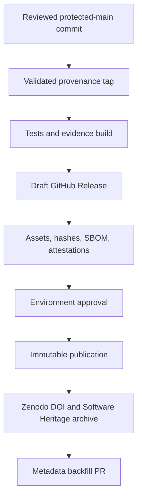

# Public Provenance and Immutable Snapshot Design

**Status:** Proposed governance and supply-chain design. The maintainer approved
the direction in discussion; this document becomes accepted only when its pull
request is reviewed and merged to `main`.

**Owner:** Franz Xu

**Repository:** `IcantFind-a-username/Sovereign-Founder-OS`

## Decision

Sovereign Founder OS will remain Apache-2.0 licensed. The project will build the
strongest practical public evidence chain for authorship, chronology,
attribution, and released artifact integrity without claiming that a public
repository can prevent independent reimplementation of its ideas.

The first immutable record will be a source and architecture **provenance
snapshot**, not a product release. It will not use a `v0.1` tag because the
repository's documented v0.1 release gates are not yet complete. A candidate
UTC date `D` will be fixed in the reviewed commit, CFF metadata, and signed tag.
The final publish step must occur on `D` in UTC; if it does not, the draft is
abandoned and a new candidate commit/date/tag is prepared. For example, a
snapshot completed on 2026-08-27 will use tag
`provenance-2026.08.27.1`, CFF version `2026.08.27-provenance.1`, and CFF
`date-released: 2026-08-27`.

## Goals

1. Record Franz Xu's explicit representation that he is the current original
   project author and rights holder for the project-authored code and
   documentation, without presenting that declaration as an independent legal
   adjudication.
2. Preserve a reviewable history showing the exact trees referenced by specific
   commit objects and their recorded author and committer timestamps.
3. Bind one exact protected-main commit, source tree, history bundle, metadata,
   and release assets into cryptographically verifiable records.
4. Place the record on independent archival infrastructure with a DOI and a
   Software Heritage persistent identifier when those services complete their
   ingestion.
5. Make future contributions and releases preserve a clear chain of origin,
   authorship, and artifact provenance.
6. Keep every maturity and security statement consistent with the implemented
   code, repository tests, RFCs, and roadmap gates.

## Non-goals and legal boundary

- The design does not prohibit copying that Apache-2.0 expressly permits.
- It does not claim that copyright protects an abstract idea, procedure,
  method, algorithmic concept, or mathematical principle. It protects original
  expression subject to applicable law.
- It does not prove global priority, patentability, absence of prior art, or
  that no third party independently conceived a similar idea.
- It does not turn a repository timestamp, a Git signature, a DOI, an
  attestation, or a Software Heritage identifier into proof of product safety.
- It does not label the current project production-ready or claim that the
  roadmap's v0.1 release gate has passed.
- It is not legal advice. Patent, trademark registration, enforcement, and
  jurisdiction-specific evidence questions require qualified counsel.

For commit history, the defensible wording will be: **“This material is present
in tree `<tree>` referenced by commit `<sha>`, whose author and committer
timestamps record `<time>`.”** Only an independently observed GitHub immutable
release, Zenodo record, or Software Heritage visit may support a statement that
material was publicly available by that service's observed date. The project
will not use “first ever,” “invented globally,” or similar claims without
independent evidence and legal review.

## Existing evidence and gaps

The current reachable history begins with commit
`97f555c9e6079d5258dba4ca2b22ef0ff7b4b1e2`, recorded on
2026-07-13, which introduced the project blueprint, architecture material, and
Apache-2.0 license. That is a Git object timestamp, not an independently
observed public-disclosure date. The repository currently has no tags or
releases. Its
`CITATION.cff` identifies Franz Xu, but it has no release version, release date,
DOI, or independent archive identifier.

`LICENSE`, `NOTICE`, `TRADEMARK.md`, and the README already contain attribution
and branding terms. They use a collective “Sovereign Founder OS Authors” label
rather than identifying the current sole rights holder. Some trademark wording
also reads more broadly than the evidence in the repository supports and must
not imply registration.

The current release workflow builds three platform archives but allows each
matrix job to create the release, masks release-creation failures, and permits
asset replacement. It does not enforce that a tag is on protected `main`, rerun
all release gates, generate checksums or an SBOM, create artifact attestations,
or stage all assets before publication. This conflicts with the release
properties described in `SECURITY.md` and `GOVERNANCE.md`; those properties
remain targets until the workflow enforces them.

## Evidence model

The project will distinguish four kinds of evidence instead of collapsing them
into a single “proof” claim:

| Evidence | What it supports | What it does not establish |
| --- | --- | --- |
| Git history and commit objects | Exact content/tree relationships and self-recorded chronology currently hosted by GitHub | The date GitHub or the public first observed the content, independent creative authorship, or global priority |
| Verified commit/release signatures and attestations | Control of an accepted signing identity or trusted workflow; exact artifact/ref binding | Originality, code safety, or human intent by themselves |
| Immutable GitHub Release | A locked tag, commit, and asset set with a release attestation | Permanent availability if the release is deleted, or independent archiving |
| Zenodo DOI and Software Heritage SWHID | Independent, persistent citation and content/archive identity | A legal judgment of ownership, novelty, or non-infringement |

Every public statement and verification guide will use these scoped meanings.

## Repository records

### Root provenance record

A root `PROVENANCE.md` will become the human-readable authority for publication
history. It will contain:

- project name, canonical repository, Franz Xu's signed author/rights-holder
  declaration, and an explicit statement that it is the declarant's
  representation rather than an independent finding;
- the exact GitHub identity and, when the owner provides one, ORCID;
- the earliest reachable repository commit and a table of important concepts or
  implementation milestones, each linked to an exact commit, tree, and path,
  with author/committer timestamps labelled as Git metadata;
- labels distinguishing current implementation, target design, research, and
  historical material;
- release tag, target commit, tree hash, release manifest hash, DOI, and SWHID
  for each completed snapshot;
- a plain statement of the evidence limits defined above; and
- maintainer signing-key fingerprints and revocation/rotation instructions only
  after a user-controlled signing key exists.

The milestone table will include only concepts already public in the repository.
It will not disclose new patent candidates or confidential implementation
details merely to make the table appear more comprehensive.

### Attribution metadata

Based on the maintainer's confirmed chain-of-title representation, `NOTICE` will
identify Franz Xu as the original project author and declarant of current
rights, while retaining a form that can accommodate future contributors without
retrospectively assigning their rights. It will not add restrictions that
contradict Apache-2.0. The Apache license text will remain unchanged except that
its application notice may name Franz Xu as the declarant copyright holder.
Authorship credit in CFF and a legal ownership declaration remain distinct
records.

`CITATION.cff` will add the provenance-snapshot version and `date-released`
before the tag is created. A DOI and optional ORCID will be added only when
exact values are available; placeholders are forbidden. At candidate freeze,
CFF, the proposed tag, and release metadata must agree on title, author,
version, date, repository URL, and license. After publication, the immutable
snapshot's embedded CFF remains canonical for what that snapshot contained;
the Zenodo version record is canonical for its DOI, and a later `main` commit
may add that DOI without pretending it was embedded in the earlier snapshot.

`TRADEMARK.md` will describe project marks and anti-confusion rules without
claiming that a mark is registered when no registration is evidenced. It will
not attempt to use trademark policy to revoke Apache permissions.

### Future contribution origin

`CONTRIBUTING.md` will require contributors to certify that they have the right
to submit their work under Apache-2.0 and to preserve third-party notices. A
standard Developer Certificate of Origin record and `Signed-off-by` process will
apply prospectively; historical commits will not be rewritten. Dependency and
third-party attribution must remain separate from claims of project authorship.

### Maintainer signing trust anchor

Before the first snapshot, Franz Xu will create or select a user-controlled GPG
or SSH signing key. The public key or allowed-signer entry, exact fingerprint,
accepted identity, creation date, and revocation/rotation procedure will be
published in `PROVENANCE.md` and associated with the maintainer's GitHub
account. The repository will pin that fingerprint rather than trusting any key
that happens to produce a GitHub “Verified” badge.

Every `provenance-*` ref will be an annotated tag signed by that key. The
workflow will verify the tag object locally against the pinned trust anchor,
record the tag object ID and signer fingerprint, and separately verify the
target commit/tree and GitHub's commit-verification result. A GitHub-signed
merge commit and a maintainer-signed tag are complementary evidence, not
interchangeable evidence.

The same key will produce a detached signature over `release-manifest.json`.
If no user-controlled trust anchor exists or either verification fails, the
workflow may produce local/dry-run evidence but must not publish the snapshot
described by this design.

## Publication class and governance

The project will define **provenance snapshot publication** as a separate class
from a SemVer product release. It may use a GitHub prerelease object as an
immutable evidence container, but it ships no product binaries, does not become
the “latest” product release, and cannot waive any roadmap, security, support,
or binary-release gate.

`GOVERNANCE.md`, `SECURITY.md`, and the README will be amended before the first
snapshot so their use of “release” distinguishes product releases from source-
only provenance publications. The unsafe legacy `v*` workflow will be disabled
from automatic publication until a separate product-release redesign satisfies
the existing binary, checksum, SBOM, signature, provenance, and support
requirements. That cross-platform redesign is not a prerequisite for creating
the source-only provenance workflow.

## Snapshot identity and release semantics

The first snapshot will use these public identifier rules. Candidate date `D`,
the annotated tag's UTC tagger date, CFF `date-released`, and GitHub publication
date must be the same UTC date. The examples below apply only if the complete
publication finishes on 2026-08-27 UTC:

| Field | Value |
| --- | --- |
| Git tag | `provenance-YYYY.MM.DD.N` (example: `provenance-2026.08.27.1`) |
| GitHub title | `Sovereign Founder OS — Public Provenance Snapshot YYYY-MM-DD` |
| CFF version | `YYYY.MM.DD-provenance.N` |
| CFF release date | `YYYY-MM-DD` |
| Release kind | GitHub prerelease and immutable release |
| Product maturity | Developer Preview; not a product release |
| Release contents | Source/history evidence only; no product binaries |

Release notes will state that the snapshot records already-public source,
documentation, architecture, and history. They will explicitly deny production
readiness, security certification, roadmap-gate completion, and exclusive legal
rights over abstract ideas.

A correction after publication creates a monotonically increasing new snapshot,
for example `provenance-2026.08.27.2`. Published tag names and assets are never
reused. Deletion is reserved for a genuine legal, privacy, credential, or
malware emergency and does not imply that independent archives can be erased.

## Release architecture

### Trigger and trust boundary

The provenance workflow will accept only signed annotated tags matching
`provenance-YYYY.MM.DD.N`. It will fail unless the tag signature matches the
pinned maintainer trust anchor, the tag resolves to a commit reachable from the
protected default branch, GitHub reports the target commit as verified, and the
candidate/tag/current UTC dates satisfy the same-day rule. A GitHub API
preflight will inspect the default-branch ruleset and required checks rather
than treating `merge-base` reachability alone as branch protection. A protected
release environment will gate final publication. Repository rules will protect
both `provenance-*` and future `v*` tags from movement or unauthorized creation.

The workflow will check out and fetch the complete default-branch and tag
history before signature, reachability, history, or bundle checks. Shallow
history is not acceptable for this workflow.

Actions will remain pinned to full commit SHAs. Permissions will be declared at
job level and limited to the minimum required. Build jobs will be read-only;
the attestation job alone receives OIDC and attestation permissions, while the
two release-lifecycle jobs receive only the contents permission needed to stage
or publish the release.

### Required gates

Before a draft release is created, the workflow will run or depend on fresh
successful evidence for:

- CFF schema validation and cross-file metadata consistency;
- `cargo fmt --all --check`;
- `cargo clippy --workspace --all-targets --all-features --locked -- -D warnings`;
- `cargo test --workspace --locked`;
- the repository file-size guardrail;
- frontend type checking;
- dependency audit and full-history secret scanning;
- GitHub API evidence that the candidate reached protected `main` through a PR
  whose required checks, including dependency review, succeeded; dependency
  review is not incorrectly rerun as a tag-only job;
- workflow linting and release-script tests; and
- verification that the tag target and recorded source commit are exact.

The workflow will also preflight repository visibility and GitHub artifact-
attestation availability, inspect the applicable branch/tag rulesets, and scan
the complete reachable history for secrets, private material, unintended large
objects, and missing third-party notices before creating a permanent history
bundle or independent archive. Every action, workflow helper, SBOM generator,
and workflow linter will be exact-version or full-SHA pinned in implementation.

### Evidence assets

The draft release will be complete before publication and contain:

1. a normalized source tarball produced from the tag target using `git archive`
   with a fixed prefix, `LC_ALL=C`, `TZ=UTC`, and `gzip -n -9`; the manifest
   records exact Git and gzip versions;
2. a Git bundle created from exactly `refs/tags/$TAG`, including its signed
   annotated tag object and reachable history but excluding unrelated local and
   remote refs;
3. an SPDX or CycloneDX SBOM produced by an exact-pinned generator and scoped to
   the `Cargo.lock` Rust dependency graph; GitHub Actions, runner packages, and
   the ephemeral TypeScript checker are recorded separately and are not
   misrepresented as part of that Rust SBOM;
4. `VERIFY.md` with checksum, bundle, tag-signature, GitHub attestation, commit,
   tree, and metadata verification commands;
5. `release-manifest.json` containing the repository, tag ref/object, commit and
   tree SHAs, maintainer signer identity/fingerprint, workflow identity/run,
   toolchain, pinned action revisions, `Cargo.lock` hash, CFF hash, and hashes
   of the four payload assets above, but not a hash of itself;
6. a detached maintainer signature over `release-manifest.json`;
7. `SHA256SUMS` covering the four payload assets, manifest, and detached
   signature, while explicitly excluding `SHA256SUMS` itself; and
8. GitHub artifact attestations for the source archive, history bundle, SBOM,
   verification guide, manifest, detached signature, and checksum file.

This acyclic layout is mandatory: no file is required to contain its own hash.
The immutable-release attestation binds the complete final GitHub asset set,
including `SHA256SUMS`.

The bundle will be checked with `git bundle verify`, cloned into an empty
temporary directory, checked with `git fsck --full`, and inspected to confirm
that `refs/tags/$TAG`, the annotated tag object ID, target commit, tree, and tag
signature match the release manifest. The workflow must use a complete clone
before creating the bundle.

The workflow will not claim bit-for-bit reproducibility for an asset unless it
actually builds that asset twice in isolated jobs and compares identical
digests. The Git bundle preserves object history but is treated as a hashed
published artifact, not assumed reproducible output.

### Draft-first publication

A single `stage-draft` job, not the build matrix, will gather the completed
workflow artifacts, create the draft, upload the complete asset set, and verify
the uploaded names and hashes. A separate `publish` job will then wait for the
protected environment approval, re-fetch and re-verify the unchanged draft,
and publish it exactly once. Error masking, `--clobber`, and concurrent release
creation are forbidden.

Immutable releases must be enabled in repository settings before publication.
After publication, GitHub's release attestation is verified and recorded. The
existing automatic product-release path will remain disabled until a separate
design and PR implement its binary-specific gather-then-publish gates. No `v*`
product tag will be created as part of this provenance snapshot.

## Independent archival flow

Before GitHub publication, the owner will connect the public repository to
Zenodo using the same GitHub identity. ORCID is desirable for identity
disambiguation but is not a blocker and will never be guessed.

After publication:

1. wait for Zenodo to ingest the release and issue the exact version DOI;
2. verify Zenodo's reported Software Heritage archival status;
3. request Software Heritage “Save Code Now” directly if the integration has
   not produced a usable archive visit;
4. verify the DOI resolves to the expected title, author, version, date, license,
   repository, and source archive;
5. record the Zenodo version DOI and concept DOI as distinct identifiers, plus
   the Software Heritage `swh:1:rev` identifier for the archived revision and,
   when available, `swh:1:dir` for its source tree, archive visit, release URL,
   commit/tree hashes, and manifest hash in `PROVENANCE.md`; and
6. add the DOI to `CITATION.cff` through a normal reviewed PR without pretending
   that the post-release commit was part of the earlier immutable snapshot.

The evidence chain is incomplete, and will be described as incomplete, until
both the GitHub immutable release and at least one independent archive record
have been verified.

## Future disclosure gate

Independently archived public chronology can support a publication-priority
record but destroys secrecy.
Before a future architectural document exposes a potentially patentable or
commercially secret mechanism, the maintainer will choose one of three paths:

1. publish it deliberately and add it to the next provenance record;
2. obtain qualified patent advice and file before public disclosure where
   appropriate; or
3. keep it outside the public repository under access control and appropriate
   confidentiality obligations.

No repository template may silently classify public material as a trade secret.
Already-public Apache-2.0 material remains public and licensed under its existing
terms.

## Automation boundary

The repository changes, validation scripts, deterministic evidence build, dry
run, branch, commits, pull requests, and CI checks may be automated. The
automation must stop before any step that would invent, extract, or impersonate
a maintainer identity or grant new external authority.

The following remain explicit owner actions or approvals:

- create and retain the user-controlled signing key, then publish its public
  trust anchor;
- enable GitHub immutable releases and tag rulesets;
- configure and approve the protected release environment;
- connect and authorize Zenodo and optionally ORCID; and
- approve final immutable publication after inspecting the staged draft.

Until those actions are complete, automation may open and merge ordinary
reviewed repository PRs and produce verified dry-run evidence, but it must not
create the provenance tag or claim that an immutable/independent evidence chain
exists.

## Failure modes and responses

| Failure | Required response |
| --- | --- |
| Metadata disagrees across CFF, manifest, tag, and release | Fail before draft creation |
| Maintainer tag signature or pinned trust anchor is missing/invalid | Stop at dry run; do not create or publish the external snapshot |
| Tag is not on protected `main` or target is not verified | Fail closed; do not create a release |
| Candidate date, tagger date, current UTC date, or CFF date differs | Abandon the draft and prepare a newly dated candidate commit/tag |
| Any test, scan, SBOM, checksum, or attestation step fails | Preserve logs; publish nothing |
| Full-history privacy/licensing preflight finds unresolved material | Block permanent bundle/archive creation pending owner review |
| One platform/job is delayed | Keep the release as a draft; never publish a partial set |
| Immutable publication contains a non-emergency error | Publish a new numbered snapshot and cross-reference the superseded one |
| Zenodo or Software Heritage ingestion fails | Keep GitHub evidence, report archival status honestly, and retry through the documented service path |
| A third party removes required Apache notices | Preserve evidence and seek project-owner/legal review; do not make automated public accusations |
| A third party independently reimplements an idea | Use the chronology record only for accurate attribution or legal review; do not claim copyright necessarily prohibits it |
| Signing key is compromised | Publish revocation information through independent channels and rotate; never rewrite old evidence |

## Verification and acceptance criteria

Implementation is accepted only when all of the following are demonstrated:

- the root provenance record contains no unsupported “first” or patent claims;
- author, title, license, version, and date agree across repository metadata;
- the maintainer tag and manifest signatures verify against the exact public
  trust-anchor fingerprint recorded before snapshot publication;
- future contribution-origin rules are explicit and prospective;
- release scripts have positive and negative tests for tag, branch, metadata,
  missing-asset, hash-mismatch, and double-publication cases;
- workflow files pass `actionlint` or an equivalent pinned validator;
- the standard repository validation commands pass from a clean checkout;
- a dry run produces the complete evidence directory without creating a tag or
  external release;
- two normalized source-archive builds produce the same SHA-256 digest;
- each payload asset appears once in both the manifest and `SHA256SUMS`; the
  manifest and its detached signature also appear once in `SHA256SUMS`, which
  excludes only itself;
- GitHub verifies artifact and immutable-release attestations for the published
  objects;
- the public release is visibly immutable and is attached to the intended
  commit;
- Zenodo metadata resolves to the intended snapshot and DOI; and
- a Software Heritage SWHID resolves to the archived project content.

## Implementation sequence

1. **Identity and publication-policy PR:** add the root provenance record;
   tighten NOTICE, CFF, trademark, contribution-origin, governance, security,
   and README wording; add metadata consistency tests; disable unsafe automatic
   `v*` publication without claiming the future product pipeline is complete.
2. **Provenance-workflow PR:** add deterministic source packaging, exact-scope
   history bundle, SBOM, acyclic manifest/checksum/signature layout,
   verification guide, workflow tests, dry-run mode, and artifact attestations.
3. **Automated dry run and review:** generate and independently inspect the
   evidence set; rerun all repository gates from the candidate commit. This is
   the end of unattended automation when owner-controlled trust/settings are
   absent.
4. **Owner trust and repository settings:** publish the maintainer trust anchor,
   enable immutable releases, protect release tags, configure the protected
   environment, and connect Zenodo before publication.
5. **Dated candidate PR:** set the exact candidate date/version in CFF and
   provenance metadata, pass protected-branch checks, and merge on the intended
   UTC publication date.
6. **Snapshot publication:** create the signed provenance tag, let the workflow
   stage the draft, approve only after asset verification, and publish on the
   candidate UTC date.
7. **Independent verification PR:** record the version/concept DOI and revision/
   directory SWHIDs after they resolve; update CFF and provenance links without
   modifying the immutable snapshot.
8. **Separate product-release PR:** redesign the cross-platform `v*` pipeline
   before any SemVer product tag, without retroactively treating the provenance
   publication as a product release.

Each implementation PR remains independently reviewable and uses conventional
commit and branch names. No product tag is created until its roadmap gates are
separately met.

## Authoritative references

- [WIPO Copyright Treaty, Articles 2 and 4](https://www.wipo.int/wipolex/en/text/295166)
- [IPOS copyright overview](https://www.ipos.gov.sg/about-ip/copyright/introduction-copyright/)
- [Apache License 2.0](https://www.apache.org/licenses/LICENSE-2.0)
- [GitHub: Immutable releases](https://docs.github.com/en/code-security/concepts/supply-chain-security/immutable-releases)
- [GitHub: Signature verification](https://docs.github.com/en/authentication/managing-commit-signature-verification/about-commit-signature-verification)
- [GitHub: Artifact attestations](https://docs.github.com/actions/security-for-github-actions/using-artifact-attestations/using-artifact-attestations-to-establish-provenance-for-builds)
- [SLSA build requirements](https://slsa.dev/spec/v1.2/build-requirements)
- [GitHub: Citation files](https://docs.github.com/en/repositories/managing-your-repositorys-settings-and-features/customizing-your-repository/about-citation-files)
- [Zenodo: Enable a GitHub repository](https://help.zenodo.org/docs/github/enable-repository/)
- [Zenodo: Archive a GitHub release](https://help.zenodo.org/docs/github/archive-software/github-upload/)
- [Software Heritage persistent identifiers](https://docs.softwareheritage.org/devel/swh-model/persistent-identifiers.html)
- [Software Heritage Save Code Now](https://docs.softwareheritage.org/user/faq/index.html#save-code-now)
- [IPOS public-disclosure guidance](https://ask.gov.sg/ipos/questions/clglxzrss00p5l408ir2trecl)
- [IPOS trade-secret overview](https://www.ipos.gov.sg/about-ip/trade-secret/)
